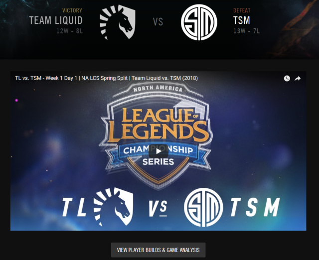
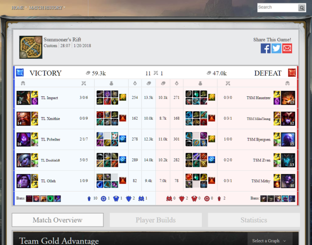
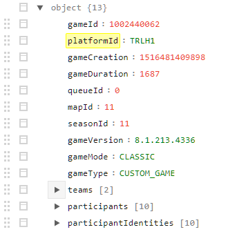

# Data Wrangling Report

Before we start explaining the wrangling process, here are the final desired data frames we'll be using for later statistical analyses and models.

## Obtaining the Data
All the match data was obtained from lolesports.com.  For eample, in order to access a NALCS 2018 Spring Split match, click on the NA LCS link as shown below:

Then, slightly change the URL to this address: https://www.lolesports.com/en_US/na-lcs/na_2018_spring/schedule/regular_season/1 (presently, change the URL section saying "na_2018_summer" to "na_2018_spring").  Now, on the page, click on a single match.  This will lead to that match's page which will look like this:

From here, click on the button near the bottom of the page that says "VIEW PLAYER BUILDS & GAME ANALYSIS".  This will open a new Tab/Window on your browser for a page showing an overview of the match's statistics:

The URL of this page contains some important information that will be needed in order to call a Web API for this match.  In fact, the Web API call can be found by opening the Web Inspector for this page (typically by pressing Ctrl+Shift+I or Command+Shift+I).  

First, click on the Network tab of the inspector.  Then, we must refresh the page in order to see the list of web requests.  Eventually, we will find the request needed: 

The encircled Request URL is, in fact, the Web API call we use in our R script in order to obtain the JSON data for this particular match.  Every single match's Web API URI uses the same prefix: https://acs.leagueoflegends.com/v1/stats/game/.  Each match also has its own unique identifiers, as shown the browser URL and web inspector screenshots below:

Now that we know how to obtain the identifiers for each match, we can open a spreadsheet program and enter these identifiers, as well as the team names and flags indicating whether the match was a tiebreaker or playoff, into individual rows.  We can then save this spreadsheet as a CSV file, which will look like this in GitHub:

(This file can be viewed [here](https://github.com/ryanthtra/lol-esports-data-analysis/blob/master/lol_pros_predictor/gameid_data/NALCS_Spring2018.csv).)

Finally, we can start the R scripting!

## R Scripting for Obtaining Match Data
As stated previously, the beginning string for the URL of the Web API for obtaining the match data JSON response is:

https://acs.leagueoflegends.com/v1/stats/game/

If we were to use the example match, he full string for this Web API is:

https://acs.leagueoflegends.com/v1/stats/game/TRLH1/1002440062?gameHash=a3b08c115923f00d

If we click on the link for this API on a browser, we should see a new tab/window that looks like this:

If we have a JSON beautifier extension installed on our browser, the respond should look something like this:

