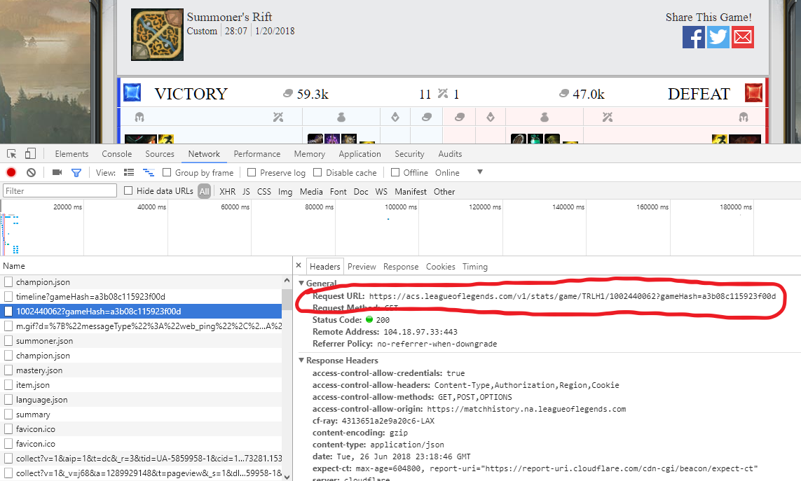
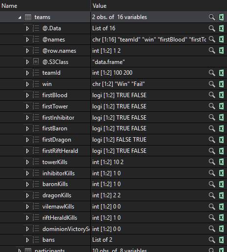

# Data Wrangling Report

Before we start explaining the wrangling process, here are the final desired data frames we'll be using for later statistical analyses and models.


## Obtaining the Data for Making API Requests
All the match identifier data was obtained from lolesports.com.  For eample, in order to access a NALCS 2018 Spring Split match, click on the NA LCS link as shown below:


Then, slightly change the URL to this address: https://www.lolesports.com/en_US/na-lcs/na_2018_spring/schedule/regular_season/1 (presently, change the URL section saying "na_2018_summer" to "na_2018_spring").  Now, on the page, click on a single match.  This will lead to that match's page which will look like this:


From here, click on the button near the bottom of the page that says "VIEW PLAYER BUILDS & GAME ANALYSIS".  This will open a new Tab/Window on your browser for a page showing an overview of the match's statistics:


The URL of this page contains some important information that will be needed in order to call a Web API for this match.  In fact, the Web API call can be found by opening the Web Inspector for this page (typically by pressing Ctrl+Shift+I or Command+Shift+I).  

First, click on the Network tab of the inspector.  Then, we must refresh the page in order to see the list of web requests.  Eventually, we will find the request needed: 



The encircled Request URL is, in fact, the Web API call we use in our R script in order to obtain the JSON data for this particular match.  Every single match's Web API URI uses the same prefix: https://acs.leagueoflegends.com/v1/stats/game/.  Each match also has its own unique identifiers, as shown the browser URL and web inspector screenshots below:


Now that we know how to obtain the identifiers for each match, we can open a spreadsheet program and enter these identifiers, as well as the team names and flags indicating whether the match was a tiebreaker or playoff, into individual rows.  We can then save this spreadsheet as a CSV file, which will look like this in GitHub:


(This file can be viewed [here](https://github.com/ryanthtra/lol-esports-data-analysis/blob/master/lol_pros_predictor/gameid_data/NALCS_Spring2018.csv).)

As stated previously, the beginning string for the URL of the Web API for obtaining the match data JSON response is:

https://acs.leagueoflegends.com/v1/stats/game/

If we were to use the example match, the full string for this Web API is:

https://acs.leagueoflegends.com/v1/stats/game/TRLH1/1002440062?gameHash=a3b08c115923f00d

If we click on the link for this API on a browser, we should see a new tab/window that looks like this:


If we have a JSON beautifier extension installed on our browser, the response should look something like this:


Finally, we can start the R scripting!

## R Scripting for Obtaining Match Data

First, we will discuss how to obtain data for a single match.

In R, to be able to make http requests, we import the httr library.  Additionally, in order to translate the JSON response to an R-friendly object, we will use the jsonlite library:

```R
library(httr)
library(jsonlite)
```
Then, we construct the Web API request URI using the ```paste()``` function: 

```R
uri <- paste(acs_prefix_domain, "/v1/stats/game/", chr_platform_id, "/", num_match_id, ifelse(chr_game_hash != "", paste("?gameHash=", chr_game_hash, sep = ""), ""), sep = "")
```
In the block above, if we use the example match again, ```acs_prefix_domain``` is https://acs.leagueoflegends.com, ```chr_platform_id``` is TRLH1, ```num_match_id``` is 1002440062, and ```chr_game_hash``` is a3b08c115923f00d.

With the ```uri``` constructed, we use this string to make the API request within a custom function, ```process_uri()```:

```R
process_uri <- function(str_uri) {
  response <- httr::GET(str_uri)
  while (response$status_code == 429) {
    Sys.sleep(2)
    response <- httr::GET(str_uri)
  }
  json <- jsonlite::fromJSON(content(response, as = "text"))
  return(json)
}
```
Note the statement ```while (response$status_code == 429)```.  The server to which we are making this request restricts the user to making a certain limited number of requests within a certain timeframe (unknown to this author).  If we go beyond this restriction during a request, the response will return a status code of 429, and we wouldn't get the data from that match.  Therefore, we are watching for this response status code, and if we get a 429, then we sleep the R runtime for two seconds before making the same request again.  Theoretically, we should get the desired 200 response code and the match data the second time around.

#### Obtaining Match Data for Multiple Matches
First, we import the CSV file that we created, which contains all the match identifiers:
```R
# NA LCS 2018 Spring Split -- Regular Season, Tiebreakers, and Playoffs
nalcs_matchid_df <- read.csv("gameid_data/NALCS_Spring2018.csv")
```
Next, we, call the custom function that makes a request for each of the 117 NALCS 2018 Spring Split matches and then returns a List object containing the 117 match datas:
```R
nalcs_matches <- get_league_match_data_list(nalcs_matchid_df)
```
Here is the custom function, ```get_league_match_data_list()```:
```R
get_league_match_data_list <- function(league_matchid_df) {
  matchlist <- list()
  for (i in 1:nrow(league_matchid_df)) {
    matchlist[[i]] <- get_acs_match_by_matchid(league_matchid_df$Region.ID[[i]], league_matchid_df$Game.ID[[i]], chr_game_hash = league_matchid_df$Hash.ID[[i]])
  }
  return(matchlist)
}
```
Now that we have match data for all 117 matches in the NALCS 2018 Spring Split, let's look at a single match:


Here, we can see the ```gameId``` and ```platformId``` strings that we used in the Web API call.  We also see the ```gameDuration``` numeric, which we will need for our "final" datasets.  However, the meat of our datasets are coming from the three data frames at the bottom: ```teams```, ```participants```, and ```participantIdentities```.  Let's look at ```teams``` first:



Also, let's look at the it in preview mode:


Before concatenating this into a cumulative data frame, this will get cleaned up in order to be useful.  The explanations are written into the code for the custom function ```get_accum_matches_teams```:

```R
nalcs_matches_teams_accum <- get_accum_matches_teams(nalcs_matches, nalcs_matchid_df)
```
```R
get_accum_matches_teams <- function(league_matchlist, league_matchid_df) {
  league_matches_teams_accum <- data.frame(NULL)
  for (i in 1:length(league_matchlist)) {
    # Convert win column (Win/Fail) to logical (TRUE/FALSE)
    league_matchlist[[i]]$teams["win"] <- as.logical(eval(league_matchlist[[i]]$teams["win"]) == "Win")
    # Add team names column
    league_matchlist[[i]]$teams["teamName"] <- unname(unlist(c(league_matchid_df[i, c("Blue.Team", "Red.Team")])))
    # Add game number column
    league_matchlist[[i]]$teams["gameNumber"] <- c(i, i)
    # Add tiebreaker and playoff column
    league_matchlist[[i]]$teams["isTiebreaker"] <- unname(unlist(c(league_matchid_df[i, c("Tiebreaker", "Tiebreaker")])))
    league_matchlist[[i]]$teams["isPlayoff"] <- unname(unlist(c(league_matchid_df[i, c("Playoff", "Playoff")])))
    # Add game duration 
    league_matchlist[[i]]$teams["duration"] <- rep(league_matchlist[[i]]$gameDuration, 2)
    
    # Concatenate rows from current match onto the accumulation DF
    league_matches_teams_accum <- league_matches_teams_accum %>% bind_rows(league_matchlist[[i]]$teams %>% select(-bans))
  }
  #Change all teamId = 100/200 to Blue/Red
  # and remove some irrelevant columns
  league_matches_teams_accum <- league_matches_teams_accum %>%
    mutate(teamId = replace(teamId, grepl('100', teamId), 'Blue')) %>%
    mutate(teamId = replace(teamId, grepl('200', teamId), 'Red')) %>%
    select(-vilemawKills, -dominionVictoryScore)
  return(league_matches_teams_accum)
}
```

