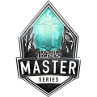

# lol-esports-data-analysis
Analysis, insights, and modeling for various League of Legends eSports leagues for the 2018 Spring Split -- a Springboard Intro to Data Science capstone project

### Introduction:
League of Legends (LoL) is a multiplayer online battle arena (MOBA) videogame by Riot Games.  The primary game mode for LoL is Summoner's Rift (which is also the name of the map, or arena), in which two teams of five players vie to destroy their opponents' base, called the Nexus.  Each player chooses one of 141 unique avatars, called champions, to represent them, and each champion has its own unique blend of attributes, skills, and abilities.

For more detailed information about the game, please see <a href="https://en.wikipedia.org/wiki/League_of_Legends#Gameplay" target="_blank">League of Legends on Wikipedia.</a>

## What is the problem you want to solve?

Firstly, I will provide analyses of accumulative match data for the 2018 Spring Split seasons among various LoL eSports leagues across the world.  Such analyses include top individual and team performers for certain categories and performance contrasts between playing on the Blue Team (whose base is on the bottom left corner of the map) and the Red Team (top right corner base).

Secondly, I will construct a predictive (linear regression) model trained from the North American League Championship Series (NALCS) 2018 Spring Split regular season data to see if this model can accurately predict the win-loss records of the teams in the European League Championship Series (EULCS) 2018 Spring Split regular season.

Finally, I will construct a clustering (hierarchical or k-means) model to see if it can correctly classify the team roles of the individual players in these eSports leagues.  Currently, there are five distinct roles for the five players on each team in a match: Top Laner, Jungler, Mid Laner, Bottom Lane Carry (often called Attack Damage Carry, or ADC for short), and Support.  

## Who is your client and why do they care about this problem? In other words, what will your client DO or DECIDE based on your analysis that they wouldn’t have otherwise?

The League of Legends community at large, fans of LoL eSports, and sports/eSports stats junkies would likely enjoy seeing a statistics and some analytics for these leagues.  Riot Games and other LoL eSports league sanctioners could publish such leaderboard stats on their own websites.

## What data are you going to use for this? How will you acquire this data?

All of the data to used for this project will come from the <a href="https://acs.leagueoflegends.com">https://acs.leagueoflegends.com</a> domain.  The match IDs used to access individual professional eSports matches come from <a href="https://www.lolesports.com">https://www.lolesports.com</a>.  Each individual match contains a Region ID, a Match ID, and a Game Hash, all of which are used to call a Web API for obtaining the match data.

httr will be used to make the web API calls, and jsonlite will be used to convert the JSON responses of these API calls into R objects.

## In brief, outline your approach to solving this problem (knowing that this might change later).

My approach to solving this problem is by obtaining all the data for the matches for the 2018 Spring Split of each of fives leagues whose match data is easily accessible: the NALCS, the EULCS, League of Legends Champions Korea (LCK), LoL Pro League (LPL; in China), and the League of Legends Master Series (LMS; Taiwan, Hong Kong, and Macau).

Each individual match will have its data wrangled into its desired observation format, which will then be concatenated to a cumulative data frame.  Further data wrangling will be used in order to calculate certain statistics, such as totals, ratios, percentages, and probabilities, and to create data frames for constructing the predictive and classification models.